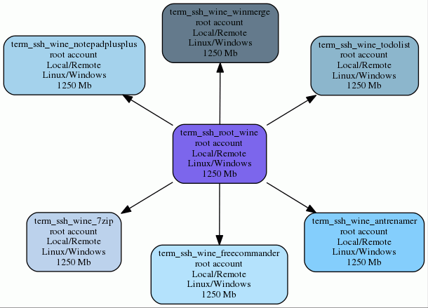

# Docker Containers Studies

## Goal

The goal of this approach is to provide Docker containers dedicated to facilitate Windows/Linux cross-over usage.

Studies are splitted into three domains : 
- Diversity of methods to produce GUI containers to access to Firefox.
- Mono environment to make possible to run Console or Gtk applications.
- Windows Portable-apps (global or dedicated) running with Wine emulator.
 
Experiment by yourself all approaches studies with the links below for Docker containers.

### Mozilla Firefox (4 Method differences for GUI containers)

Last version of Mozilla Firefox ready to use.

:checkered_flag: [X11shared (sudoers)](https://github.com/marchandd/term_x11shared_sudoers_firefox/ "X11shared") but dangerous access permissions... 

:checkered_flag: [VNC (root with xvfb & wine)](https://github.com/marchandd/vncxvfb_wine_firefox/ "VNC") with VNC protocol but not crypted... 

Remote access and more secure with SSH protocol:

:checkered_flag: [SSH (root)](https://github.com/marchandd/term_ssh_root_firefox/ "SSH") 

:checkered_flag: [SSH (non root user)](https://github.com/marchandd/term_ssh_user_firefox/ "SSH") 

### Mono Environment (2 ways) and Editor (1)

Since [Microsoft announced 11.12.2014](http://news.microsoft.com/2014/11/12/microsoft-takes-net-open-source-and-cross-platform-adds-new-development-capabilities-with-visual-studio-2015-net-2015-and-visual-studio-online/ "Microsoft announce"), .NET and Visual Studio Community are committed to supporting free and cross-platform, Mono won to be discovered in a Linux environment.  

Last version of Mono environment ready to be exploited for Mono app.

:checkered_flag: [Mono Docker official (SSH root)](https://github.com/marchandd/term_ssh_root_mono/ "SSH") A Docker official version but not mono-complete. 

:checkered_flag: [Xamarin:copyright: Mono-complete install (SSH user)](https://github.com/marchandd/term_ssh_user_monodotnet45/ "SSH")

Last version of Mono environment IDE ready to use.

:checkered_flag: [Xamarin:copyright: MonoDevelop IDE (SSH user)] (https://github.com/marchandd/term_ssh_user_monodevelop/ "SSH")

### Multiple Windows Portable-apps (2 ways)

Windows Portable-apps samples easy to install, update and use with VNC.

:checkered_flag: [Windows Portable-apps samples (VNC)](https://github.com/marchandd/vncxvfb_wine_portableapps/ "VNC") 

Windows Portable-apps samples easy to install, update and use with SSH.

:soon: [Wine (SSH root)](https://github.com/marchandd/term_ssh_root_wine/ "SSH")

:soon: [Windows Portable-apps samples (SSH root)](https://github.com/marchandd/term_ssh_root_portableapps/ "SSH")

### Specific Windows Portable-apps (5)

Windows Portable-apps samples dedicated easy to install, update and use.

:soon: [Antp.be:copyright: AntRenamer Portable (SSH root)](https://github.com/marchandd/term_ssh_root_antrenamer/ "SSH") 

:soon: [Marek Jasinski:copyright: FreeCommander Portable (SSH root)](https://github.com/marchandd/term_ssh_root_freecommander/ "SSH")  

:soon: [Notepad++Team:copyright: Notepad++ Portable (SSH root)](https://github.com/marchandd/term_ssh_root_notepadplusplus/ "SSH") 

:soon: [AbstractSpoon:copyright: ToDoList Portable (SSH root)](https://github.com/marchandd/term_ssh_root_todolist/ "SSH") 

:soon: [Grimm-Thingamahoochie Software:copyright: WinMerge Portable (SSH root)](https://github.com/marchandd/term_ssh_root_winmerge/ "SSH") 

## Usage

[License](LICENSE "License")
